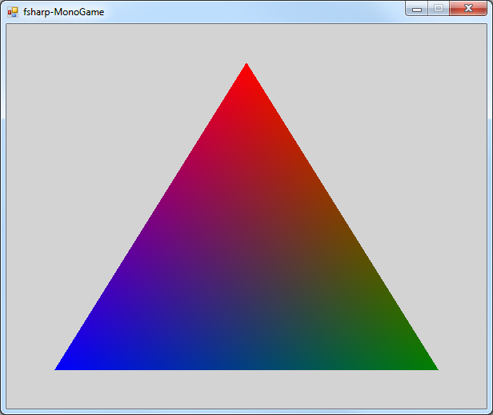

# THIS REPO IS OBSOLETE

Please see [monogame-fsharp](https://github.com/markpattison/monogame-fsharp) for an updated sample using MonoGame 3.8 and .NET Core 3.1.

# fsharp-monogame

A sample solution using MonoGame with F#, incorporating Paket and FAKE 5.

## Prerequisites

1. Install [MonoGame](http://www.monogame.net/downloads/) (at least v3.6), noting the installation path.
2. Install the [.NET Core SDK](https://www.microsoft.com/net/download/) (at least v2.1.301).
3. Open a new command prompt and install the [FAKE 5](https://fake.build/fake-gettingstarted.html) CLI using `dotnet tool install fake-cli -g`.

## Instructions

1. Clone the repository.
2. If your MonoGame installation path is not `C:\Program Files (x86)\MSBuild\MonoGame\v3.0\Tools\MGCB.exe`, edit `MonoGame.fsx` accordingly.
3. Build and run using `fake build -t RunApp`.
4. You should see the triangle below.

